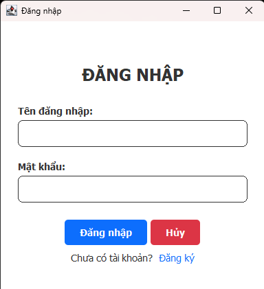
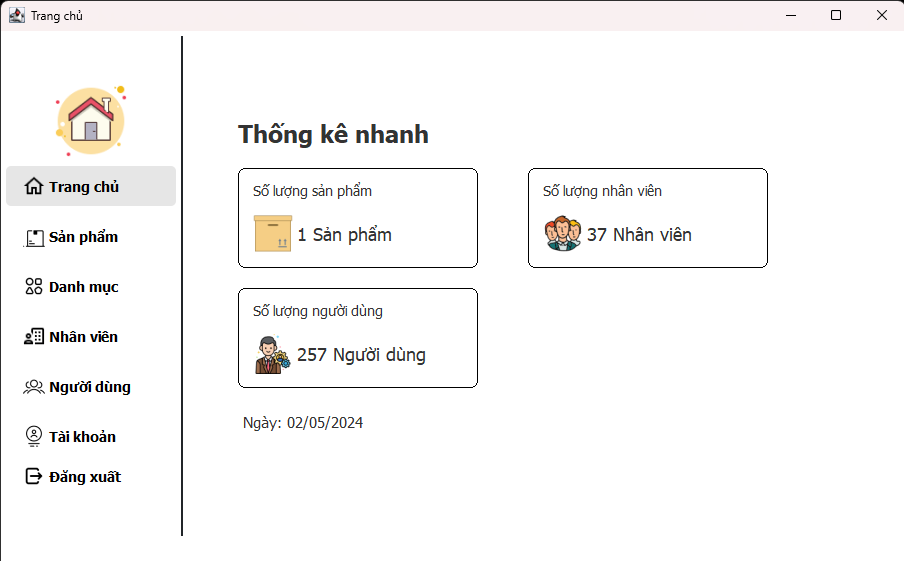
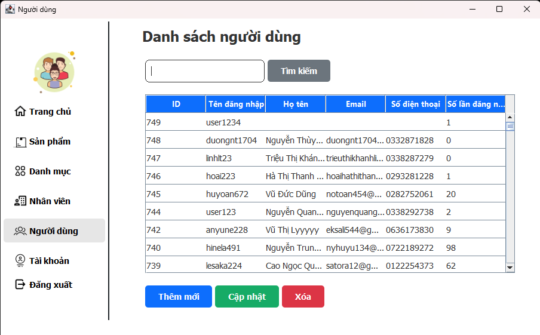
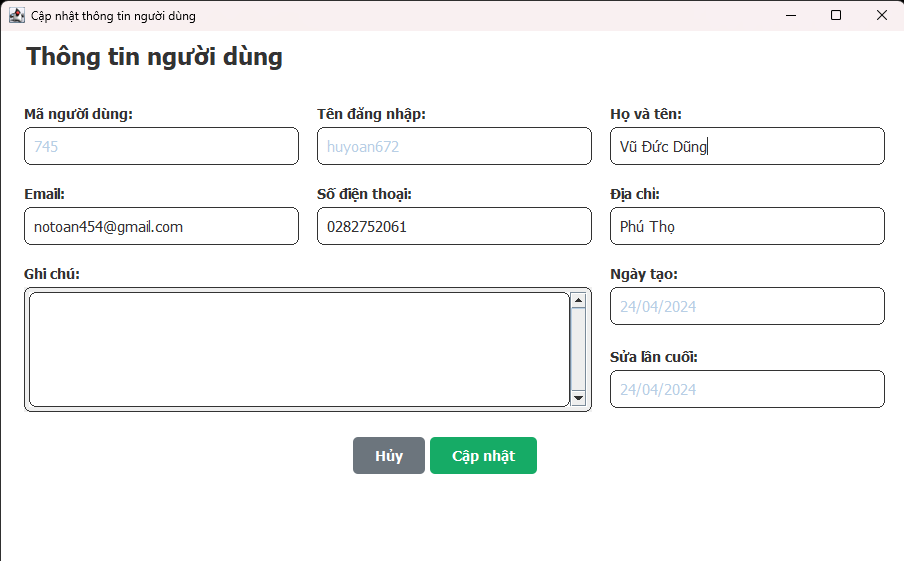
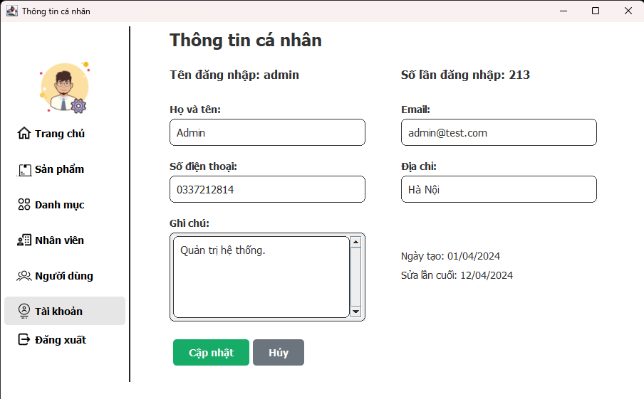

## Demo
### Sign in
<div align="center">

</div>

### Home
<div align="center">

</div>

### User List
<div align="center">

</div>

### Update User
<div align="center">

</div>

### Personal Information
<div align="center">

</div>

## Tech Stack

<br>


## Get Start
- Restore database.
- Change MySQL connection in `Databases.ConnectionPoolImpl`:
```java
public ConnectionPoolImpl() {
		this.driver = "com.mysql.jdbc.Driver";
		this.url = "jdbc:mysql://localhost:3306/<your database's name>?allowMultiQueries=true";
		this.username = "your username";
		this.userpass = "your password";
		this.loadDriver();
		this.pool = new Stack<>();
}
```
- Run in `Views.MainView` .